# Housing Sales Price Prediction Using Linear Regression with Regularization

***  
### Problem Statement
 

    
This study develops a model to predict the sales price of residential properties in Ames, IA. The features include square feet, number of bedrooms and bathroom, year-built, interior and exterior conditions, etc. Data set contains information from the Ames Assessor’s Office used in computing assessed values for individual residential properties sold in Ames, IA from 2006 to 2010 [[(*source*)](http://jse.amstat.org/v19n3/decock/DataDocumentation.txt). The model is trained with the data in Training set and evaluated with price of houses sold in Test set

 
### Contents:
- [Background](#Background)
- [Housing Market in Ames, IA](#Housing-Market-in-Ames,-IA)
- [Datasets](#Background)
- [Methodology](#Methodology)
- [Regression Model](#Regression-Model)
- [Conclusion Model](#Conclusion)
- [References](#References)

 
### Background
 

    
Ames, founded in 1864, is a college town in the Story County in central Iowa with a population of 66,258 in 2019. The city was named after Oakes Ames, a 19th century U.S. congressman from Massachusetts, who was a railroad promoter and never lived in Ames, Iowa [(*source*)](https://www.cityofames.org/about-ames/interesting-facts-about-ames).
 
The city is the home of Iowa State University (ISU) with 33,391 registered students in 2019. The State University is one of the largest universities in US and it accounts for half of the city population and is the top employer in the city. Ames, IA is the only city in US where half of its residents are enrolled a college.
    
Ames hosts multiple federal and state sites:
- the largest federal animal disease center in the US
- USDA's Agricultural Research Service's National Animal Disease Center (NADC)
- USDA sites for the Animal and Plant Health Inspection Service (APHIS)
- Ames also hosts the headquarters for the Iowa Department of Transportation ([*source*](https://en.wikipedia.org/wiki/Ames,_Iowa)).

Fun facts about Ames, IA are ([*source*](https://www.thinkames.com/ames-ia-named-best-college-town-in-america/)):
- Adults with a bachelor’s degree: 62.7%
- Median age: 23
- Unemployment rate (2018): 1.5% (less than half the US Unemployment rate in 2018)
- Bars and restaurants: 236 per 100,000 people

   

***  
### Housing Market in Ames, IA
 

Ames holds one of the most expensive real estate markets in Iowa. The median home price in Ames is \$239,563, which is substantially higher than the median price of \$167,640 for homes in Iowa [(source)](https://www.zillow.com/ia/home-values). Close to 74% of homes in Ames are in the range of \$107,000 to \$321,000 (Figure 2).  
As shown in Figure 3, apartment complexes (41% of available homes) and single-family homes (40% of total available homes) are the most prevalent housing types in the town. Most of the residential properties has been built after 1970, as shown in Figure4.  
As shown in Figure 5, renters and homeowners occupy more than 65% and 34% of homes in Ames, IA, respectively. Since half of the town residents are college students, who leave the town after their graduation, a large percentage of residential properties are apartment complexes and renters’ properties. Students usually prefer to live in apartment complexes, and not single-family homes, because of their perks, convenience, and a lack of interest for a longtime commitment

<table><tr>
<td bgcolor="ghostwhite"> 
    <figure>
        
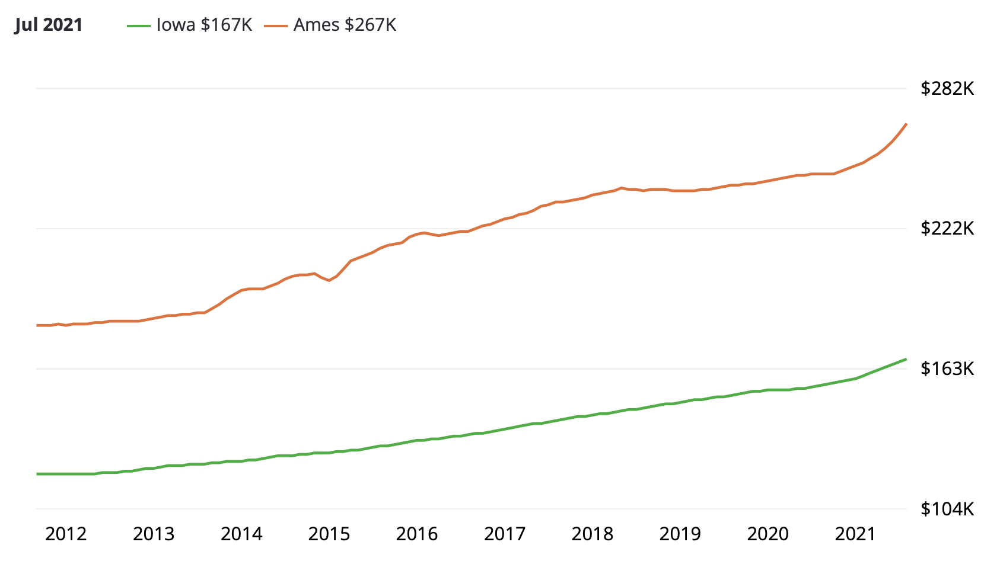

        
<figcaption>Figure 1.House Prices in Ames, IA vs. state of Iowa <a href="https://www.zillow.com/ia/home-values">Zillow</a> </figcaption>
  
    </figure> 
</td>    
<td bgcolor="ghostwhite">
    <figure>
        
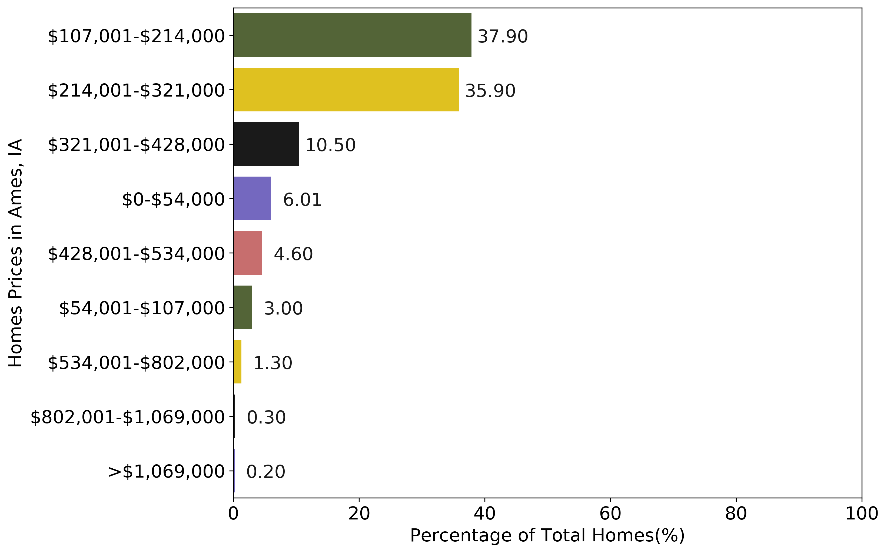

        
<figcaption>Figure 2. Distribution of Home Prices in in Ames, IA <a href="https://www.neighborhoodscout.com/ia/ames/real-estate#data">Neighborhood Scout</a> </figcaption>
  
    </figure>
</td>
</tr></table>  

<table><tr>
<td bgcolor="ghostwhite"> 
    <figure>
        
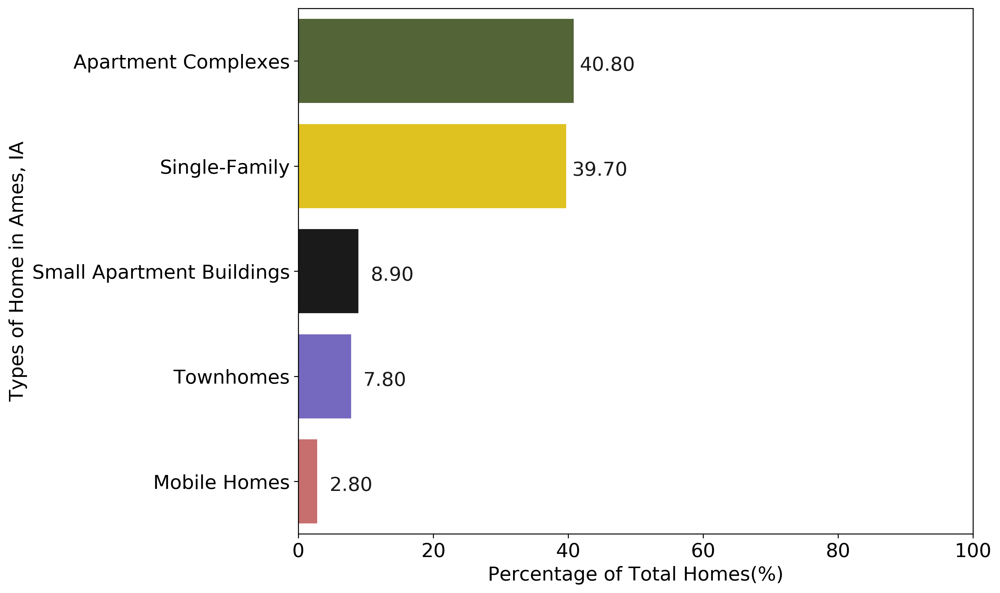

        
<figcaption>Figure 3. Distribution of Property Types in Ames, IA <a href="https://www.neighborhoodscout.com/ia/ames/real-estate#data">Neighborhood Scout</a> </figcaption>
  
    </figure>
</td>    
<td bgcolor="ghostwhite">
    <figure>
        
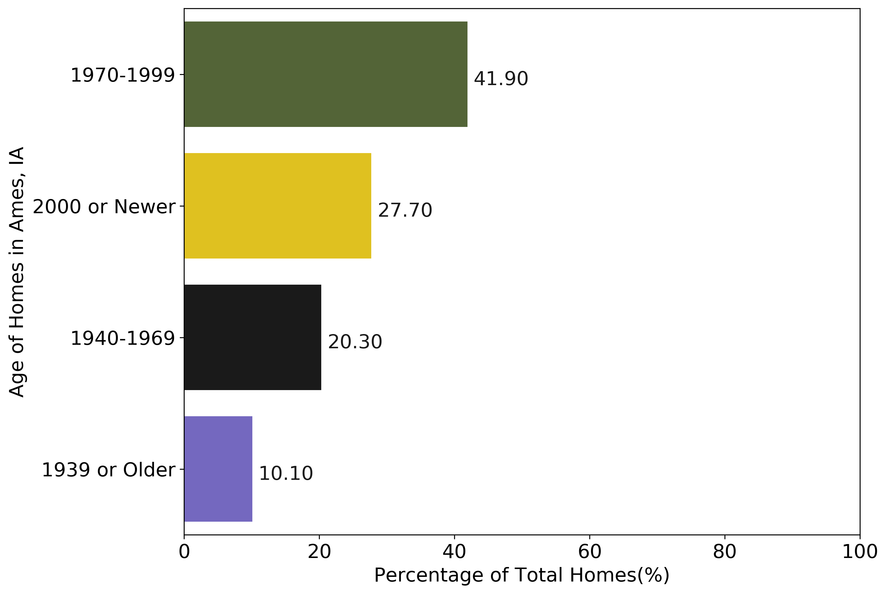

        
<figcaption>Figure 4. Distribution of House Ages in Ames, IA <a href="https://www.neighborhoodscout.com/ia/ames/real-estate#data">Neighborhood Scout</a> </figcaption>
  
    </figure> 
</td>
</tr></table>  

<table><tr>
<td bgcolor="ghostwhite"> 
    <figure>
        
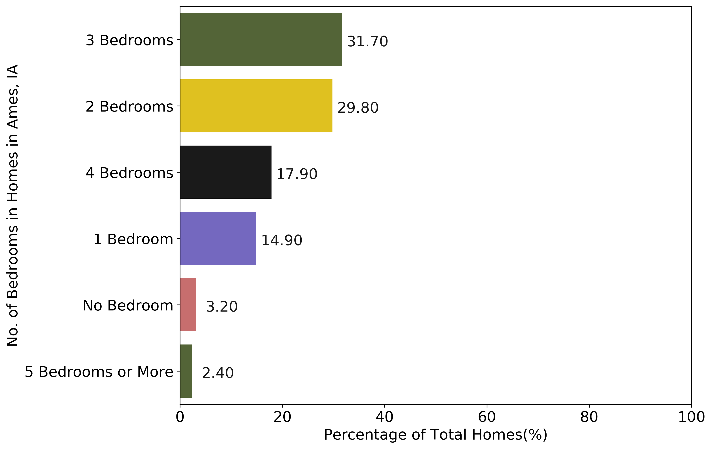

        
<figcaption>Figure 5. Distribution of No. of Bedrooms for Houses in Ames, IA <a href="https://www.neighborhoodscout.com/ia/ames/real-estate#data">Neighborhood Scout</a> </figcaption>
  
    </figure> 
</td>    
<td bgcolor="ghostwhite">
    <figure>
        
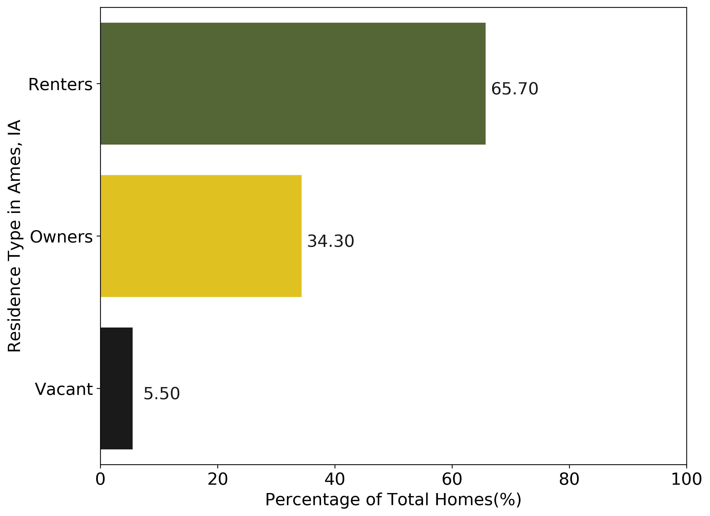

        
<figcaption>Figure 6. Residence Type Distribution in in Ames, IA <a href="https://www.neighborhoodscout.com/ia/ames/real-estate#data">Neighborhood Scout</a> </figcaption>
  
    </figure> 
</td>
</tr></table>  

 

***  
###  Datasets
 

The raw data available on [AmesHousing](http://jse.amstat.org/v19n3/decock/DataDocumentation.txt) has 82 columns which include 23 nominal, 23 ordinal, 14 discrete, and 20 continuous variables; however, for this study, the data is being split into two separate Training and test sets. The Training set has 2051 observations with 81 features (including the sale price). The Test set has 878 observations with 80 features, which excludes the sale price since this is the target variable. In Training and Test datasets, there are 9822 and 4171 missing values, respectively. Pool_QC, Misc_Feature, Alley, Fence, and Fireplace_Qu acount for 87% of missing values in both Training and Test sets.

|Feature|Type |Description|Missing Values in Training|Missing Values in Test|
|:---|:---|:---|:--- |:---|
|PID|Nominal|Parcel identification number|0|0|
|MS SubClass|Nominal|Identifies the type of dwelling involved in the sale|0|0|
|MS Zoning|Nominal|Identifies the general zoning classification of the sale|0|0|
|Lot Frontage|Continuous|Linear feet of street connected to property|330|160|
|Lot Area|Continuous|Lot size in square feet|0|0|
|Street|Nominal|Type of road access to property|0|0|
|Alley|Nominal|Type of alley access to property|1911|820|
|Lot Shape|Ordinal|General shape of property|0|0|
|Land Contour|Nominal|Flatness of the property|0|0|
|Utilities|Ordinal|Type of utilities available|0|0|
|Lot Config|Nominal|Lot configuration|0|0|
|Land Slope|Ordinal|Slope of property|0|0|
|Neighborhood|Nominal|Physical locations within Ames city limits|0|0|
|Condition 1|Nominal|Proximity to various conditions|0|0|
|Condition 2|Nominal|Proximity to various conditions|0|0|
|Bldg Type|Nominal|Type of dwelling|0|0|
|House Style|Nominal|Style of dwelling|0|0|
|Overall Qual|Ordinal|Rates the overall material and finish of the house|0|0|
|Overall Cond|Ordinal|Rates the overall condition of the house|0|0|
|Year Built|Discrete|Original construction date|0|0|
|Year Remod/Add|Discrete|Remodel date (same as construction date if no remodeling or additions)|0|0|
|Roof Style|Nominal|Type of roof|0|0|
|Roof Matl|Nominal|Roof material|0|0|
|Exterior 1|Nominal|Exterior covering on house|0|0|
|Exterior 2|Nominal|Exterior covering on house (if more than one material)|0|0|
|Mas Vnr Type|Nominal|Masonry veneer type|22|1|
|Mas Vnr Area|Continuous|Masonry veneer area in square feet|22|1|
|Exter Qual|Ordinal|Evaluates the quality of the material on the exterior|0|0|
|Exter Cond|Ordinal|Evaluates the present condition of the material on the exterior|0|0|
|Foundation|Nominal|Type of foundation|0|0|
|Bsmt Qual|Ordinal|Evaluates the height of the basement|55|25|
|Bsmt Cond|Ordinal|Evaluates the general condition of the basement|55|25|
|Bsmt Exposure|Ordinal|Refers to walkout or garden level walls|58|25|
|BsmtFin Type 1|Ordinal|Rating of basement finished area|55|25|
|BsmtFin SF 1|Continuous|Type 1 finished square feet|1|25|
|BsmtFinType 2|Ordinal|Rating of basement finished area (if multiple types)|56|25|
|BsmtFin SF 2|Continuous|Type 2 finished square feet|1|0|
|Bsmt Unf SF|Continuous|Unfinished square feet of basement area|1|0|
|Total Bsmt SF|Continuous|Total square feet of basement area|0|0|
|Heating|Nominal|Type of heating|0|0|
|HeatingQC|Ordinal|Heating quality and condition|0|0|
|Central Air|Nominal|Central air conditioning|0|0|
|Electrical|Ordinal|Electrical system|0|0|
|1st Flr SF|Continuous|First Floor square feet|0|0|
|2nd Flr SF|Continuous|Second floor square feet|0|0|
|Low Qual Fin SF|Continuous|Low quality finished square feet (all floors)|0|0|
|Gr Liv Area|Continuous|Above grade (ground) living area square feet|0|0|
|Bsmt Full Bath|Discrete|Basement full bathrooms|2|0|
|Bsmt Half Bath|Discrete|Basement half bathrooms|2|0|
|Full Bath|Discrete|Full bathrooms above grade|0|0|
|Half Bath|Discrete|Half baths above grade|0|0|
|Bedroom|Discrete|Bedrooms above grade (does NOT include basement bedrooms)|0|0|
|Kitchen|Discrete|Kitchens above grade|0|0|
|KitchenQual|Ordinal|Kitchen quality|0|0|
|TotRmsAbvGrd|Discrete|Total rooms above grade (does not include bathrooms)|0|0|
|Functional|Ordinal|Home functionality (Assume typical unless deductions are warranted)|0|0|
|Fireplaces|Discrete|Number of fireplaces|0|0|
|FireplaceQu|Ordinal|Fireplace quality|1000|422|
|Garage Type|Nominal|Garage location|113|44|
|Garage Yr Blt|Discrete|Year garage was built|114|45|
|Garage Finish|Ordinal|Interior finish of the garage|114|45|
|Garage Cars|Discrete|Size of garage in car capacity|1|0|
|Garage Area|Continuous|Size of garage in square feet|1|0|
|Garage Qual|Ordinal|Garage quality|114|45|
|Garage Cond|Ordinal|Garage condition|114|45|
|Paved Drive|Ordinal|Paved driveway|0|0|
|Wood Deck SF|Continuous|Wood deck area in square feet|0|0|
|Open Porch SF|Continuous|Open porch area in square feet|0|0|
|Enclosed Porch|Continuous|Enclosed porch area in square feet|0|0|
|3-Ssn Porch|Continuous|Three season porch area in square feet|0|0|
|Screen Porch|Continuous|Screen porch area in square feet|0|0|
|Pool Area|Continuous|Pool area in square feet|0|0|
|Pool QC|Ordinal|Pool quality|2042|874|
|Fence|Ordinal|Fence quality|1651|706|
|Misc Feature|Nominal|Miscellaneous feature not covered in other categories|1986|837|
|Misc Val|Continuous|$Value of miscellaneous feature|0|0|
|Mo Sold|Discrete|Month Sold (MM)|0|0|
|Yr Sold|Discrete|Year Sold (YYYY)|0|0|
|Sale Type|Nominal|Type of sale|0|0|
|SalePrice|Continuous|Sale price $$|0|0|

 

***   
###  Methodology
 

 

#### 1. Raw Data Analysis:

This project predicts the sales price of residential properties in Ames, IA; therefore, all the datapoints that have not been tagged as residential are removed from Training set. The exercise reduces the dimensions of Training set from (2051, 81) to (2029, 81). The *PID* (Parcel identification number) column is being dropped from Training and Test sets.  

|Zoning Type|Value counts of different zoning in Training|	Value counts of different zoning in Test|
|:--- |:---:|:---:|
|Agriculture|	2|	0|
|Commercial|	19|	6|
|Floating Village Residential|	101|	38|
|Industrial|	1|	1|
|Residential High Density|	14|	13|
|Residential Low Density|	1598|	674|
|Residential Medium Density|	316|	146|

There are also inconsistencies in data type in 'Garage_Cars' column between Training and Test sets. The values in this column are changed from floats to integers. The single missing value in this column is replaced by the mode of 'Garage_Type'=='Detchd', which is equal to 2.  

Another probel is presence of outliers in Gr_Liv_Area and Lot_Area columns in Training set. The two outliers in Gr_Liv_Area are relatively large houses but sold for prices, which may not represent their actual market values.

<table><tr>
<td bgcolor="ghostwhite"> 
    <figure>
        
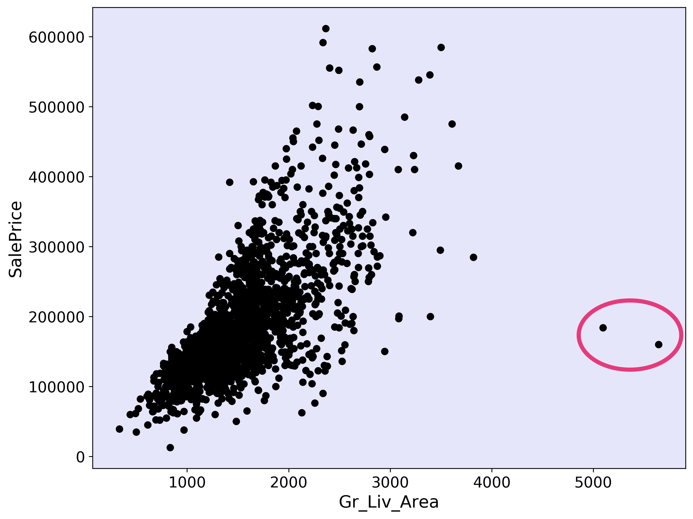

        
<figcaption>Figure 7. Scatter Plot of Gr_Liv_Area Feature vs. SalePrice.</figcaption>
  
    </figure>
</td>    
<td bgcolor="ghostwhite">
    <figure>
        
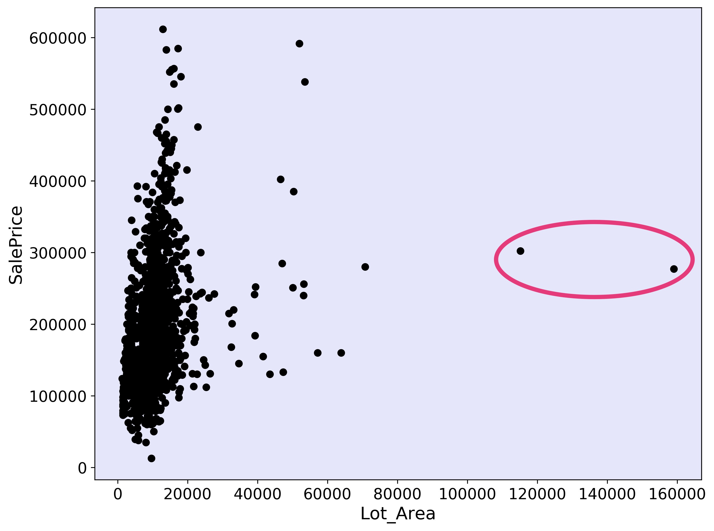

        
<figcaption>Figure 8. Scatter Plot of Lot_Area Feature vs. SalePrice. </figcaption>
  
    </figure> 
</td>
</tr></table>  

By looking at the statistics shown below, a typo is discovered in one of the entries for *Garage_Yr_Blt* column. The max entry for this column is 2207. This entry value is replaced by 2007. 

 

|Column|	count|	mean|	std|	min|	25\%|	50\%|	75\%|	max|
|:--- |:---|:---|:--- |:---|:---|:--- |:---|:---|
|1st_Flr_SF|	2029.0|	1167.680138|	396.644265|	334.0|	882.00|	1096.0|	1411.00|	5095.0|
|2nd_Flr_SF|	2029.0|	330.906358|	426.763299	|0.0	|0.00|	0.0	|700.00	|1862.0|
|3Ssn_Porch|	2029.0|	2.577132|	25.297005|	0.0	|0.00|	0.0	|0.00|	508.0|
|Bedroom_AbvGr|	2029.0|	2.849187|	0.825461|	0.0|	2.00|	3.0|	3.00|	8.0|
|BsmtFin_SF_1|	2028.0|	445.675542|	461.617933|	0.0|	0.00|	373.5|	736.25	|5644.0|
|BsmtFin_SF_2|	2028.0|	48.479290|	165.817828|	0.0	|0.00|	0.0|	0.00|	1474.0|
|Bsmt_Full_Bath|	2027.0|	0.431179|	0.523462|	0.0|	0.00|	0.0	|1.00	|3.0|
|Bsmt_Half_Bath|	2027.0|	0.064134|	0.252981|	0.0|	0.00|	0.0|	0.00|	2.0|
|Bsmt_Unf_SF	|2028.0|	569.341223|	445.552677|	0.0	|222.00|	475.0|	811.50	|2336.0|
|Enclosed_Porch|	2029.0|	21.981764|	59.397793|	0.0|	0.00|	0.0	|0.00|	432.0|
|Fireplaces|	2029.0|	0.597339|	0.638981|	0.0|	0.00|	1.0|	1.00|	4.0|
|Full_Bath	|2029.0|	1.583046|	0.548108|	0.0|	1.00|	2.0|	2.00|	4.0|
|Garage_Area	|2028.0|	476.230276|	214.483300|	0.0	|326.75|	480.0|	576.00|	1418.0|
|Garage_Cars	|2028.0|	1.786982|	0.758434|	0.0|	1.00|	2.0|	2.00|	5.0|
|$\color{red}{\text{Garage_Yr_Blt}}$|	1923.0|	1978.816953|	25.283965|	1900.0	|1961.00|	1980.0|	2002.00	|$\color{red}{\text{2207.0}}$|
|Gr_Liv_Area	|2029.0|	1503.906358|	499.828858|	334.0|	1136.00	|1453.0	|1733.00|	5642.0|
|Half_Bath	|2029.0|	0.374076	|0.502006|	0.0|	0.00|	0.0|	1.00|	2.0|
|Id|	2029.0	|1471.834894|	841.957144|	1.0|	754.00|	1480.0|	2190.00	|2930.0|
|Kitchen_AbvGr|	2029.0|	1.042385|	0.208728|	0.0	|1.00|	1.0|	1.00|	3.0|
|Lot_Area	|2029.0|	10062.695416|	6752.640877|	1300.0|	7500.00	|9457.0	|11526.00|	159000.0|
|Lot_Frontage|	1699.0|	69.048264|	23.310952|	21.0|	58.00|	68.0|	80.00|	313.0|
|Low_Qual_Fin_SF|	2029.0|	5.319862|	50.089680|	0.0|	0.00|	0.0|	0.00|	1064.0|
|MS_SubClass	|2029.0|	57.069985|	42.780321|	20.0|	20.00|	50.0|	70.00|	190.0|
|Mas_Vnr_Area|	2007.0|	100.788739|	175.606442|	0.0	|0.00|	0.0	|163.50	|1600.0|
|Misc_Val|	2029.0|	52.106949	|576.471583|	0.0|	0.00|	0.0|	0.00|	17000.0|
|Mo_Sold|	2029.0|	6.211434|	2.741159|	1.0	|4.00|	6.0|	8.00|	12.0|
|Open_Porch_SF|	2029.0|	47.455890|	65.533644|	0.0	|0.00|	27.0|	70.00|	547.0|
|Overall_Cond|	2029.0|	5.567767|	1.095520|	1.0	|5.00|	5.0	|6.00|	9.0|
|Overall_Qual|	2029.0|	6.140463|	1.402479|	1.0|	5.00|	6.0|	7.00|	10.0|
|Pool_Area	|2029.0|	2.423854|	37.986123	|0.0	|0.00|	0.0|	0.00|	800.0|
|SalePrice	|2029.0|	182631.801873|	78819.047770|	12789.0|	130000.00|	163500.0|	214900.00|	611657.0|
|Screen_Porch|	2029.0|	16.690488|	57.658647|	0.0|	0.00|	0.0	|0.00|	490.0|
|TotRms_AbvGrd|	2029.0|	6.445540|	1.559667|	2.0|	5.00|	6.0	|7.00|	15.0|
|Total_Bsmt_SF|	2028.0|	1063.496055|	447.194678	|0.0|	796.00|	1001.0|	1325.25|	6110.0|
|Wood_Deck_SF|	2029.0|	94.668310|	128.922208|	0.0|	0.00|	0.0	|168.00	|1424.0|
|Year_Built	|2029.0|	1972.221784|	29.857636|	1872.0|	1954.00|	1975.0|	2001.00	|2010.0|
|Year_Remod/Add|	2029.0|	1984.471661|	20.894136|	1950.0	|1965.00|	1993.0|2004.00|	2010.0|
|Yr_Sold|	2029.0|	2007.775259	|1.309486|	2006.0	|2007.00	|2008.0	|2009.00|	2010.0|

#### 2. Transformation and Selection of Numerical Features:

Three new columns are created to account for house age, year-passed since remodeling or renovation, and the overall home condition (being a combination of overall house material and condition). The overall house material and condition are scaled from 1 to 10, where 1 and 10 represent very poor and very excellent quality or condition.  
The table in Dataset section show that several features in both Training and Test sets have missing values. The NaN values for these features should be handled before doing any modeling. A developed function assumes a linear relationship between the features with missing values and their Gr_Liv_Area.
 
Below is a histogram of numerical columns in Training dataset. The plots suggest that the data is heavily skewed, and it requires a form of transformation or normalization (Figure 9 and Figure 10). A log transformation is applied to the numerical features and the target variable (SalePrice) to create a more normal distribution. The 'Year_Built', 'Year_Remod/Add', and 'Garage_Yr_Blt' are dropped before training the model.

<table><tr>
<td bgcolor="ghostwhite"> 
    <figure>
        
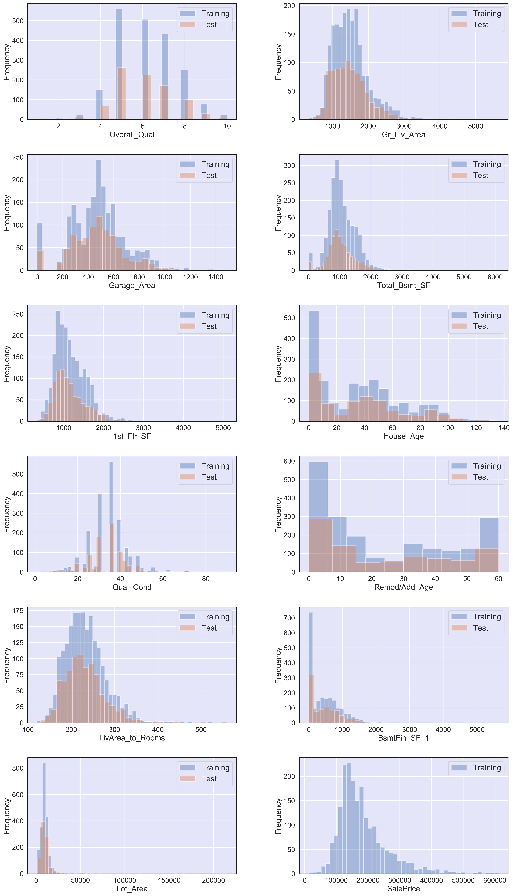

        
<figcaption>Figure 9. Histogram of Numerical Columns Before Transformation. </figcaption>
  
    </figure>
</td>    
<td bgcolor="ghostwhite">
    <figure>
        
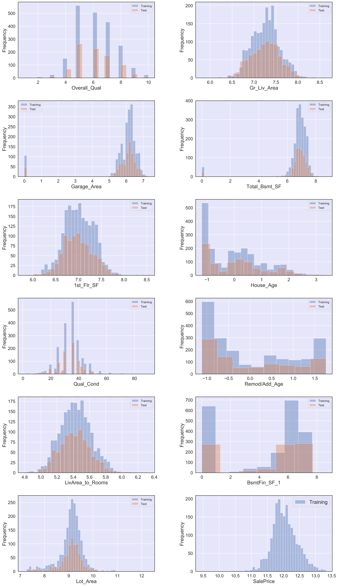

        
<figcaption>Figure 10. Histogram of Numerical Columns After Transformation. </figcaption>
  
    </figure> 
</td>
</tr></table>  
 

Heatmap is a helpful tool to graphically represent the collinearity between features and select the features for the model. Figure 11 shows heatmap of the numerical features vs the target variable (SalePrice). The selected features have a Pearson correlation coefficient of 0.18 to 0.90 against the SalePrice variable. Figure 12 uses the Regplot function in Seaborn to show a linear regression model fit for the selected features vs. the SalePrice target.

<table><tr>
<td bgcolor="ghostwhite"> 
    <figure>
        
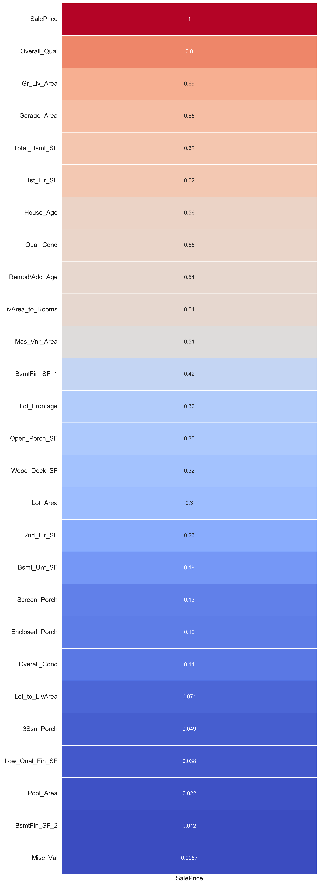

        
<figcaption>Figure 11. Heatmap of Numerical Features Against the SalePrce Variable. </figcaption>
  
    </figure>
</td>    
<td bgcolor="ghostwhite">
    <figure>
        
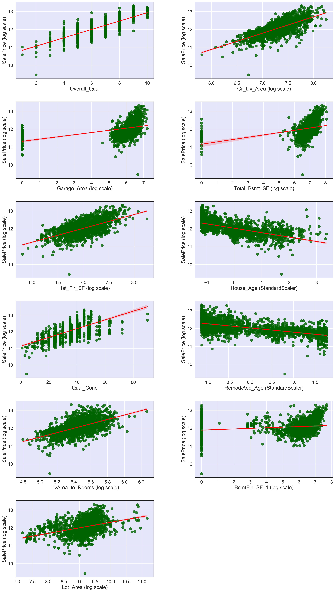

        
<figcaption>Figure 12. A Linear Regression Model Fit for the Selected Features vs. the SalePrice Target. </figcaption>
  
    </figure> 
</td>
</tr></table>  

<figure>
    
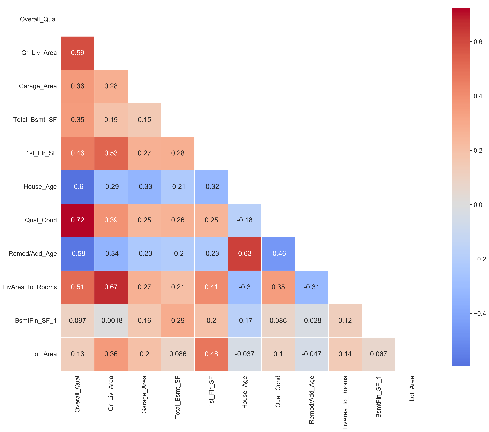
 
    
<figcaption>Figure 13. Collinearity Check for Numerical Features.</figcaption>
  
</figure> 
 

#### 3. Categorical Features Selection:

In this section, Lasso is used to filter out the features that have no significant impacts on sales price. First, each categorical variable is being dummified and its RMSE score is calculated. A combination of RMSE score and the values of Lasso coefficients determines whether to keep or drop a specific feature. Figure 14 uses a boxplot to visualize the significance of different groups in each feature against the SalePrice variable. As shown in this figure, not all the dumified variables have substantial impacts on RMSE. A second round of iterative process filters out the insignificant dummified variables. The red circles in horizontal label for each feature shows the selected dumified variables.

<figure>
    

 
    
<figcaption>Figure 14. Selected Categorical Features va. SalePrice. </figcaption>
  
</figure> 
 

### Regression Model

The next step after cleaning data, managing missing values, and features selection is to train a multiple linear regression model. Before using this method, it is a good practice to make sure that the data meets the required assumptions. The multiple regression model assumes that the relationship between independent variable and the target variable is linear. Homoscedasticity, independence of observations, and normality are other assumptions. The Training dataset is split 75\% to 25\% to two independent sets using the sklearn train_test_split function. After data split, models are trained with a 5-fold cross validation.

Figure 15a, b shows the scatter plots of the predicted values vs. actual values, and the residuals for Ridge regression. The normal shape of residuals around the horizontal axis shows the multiple linear regression is a good model to fit the data.

<table><tr>
<td bgcolor="ghostwhite"> 
    <figure>
        
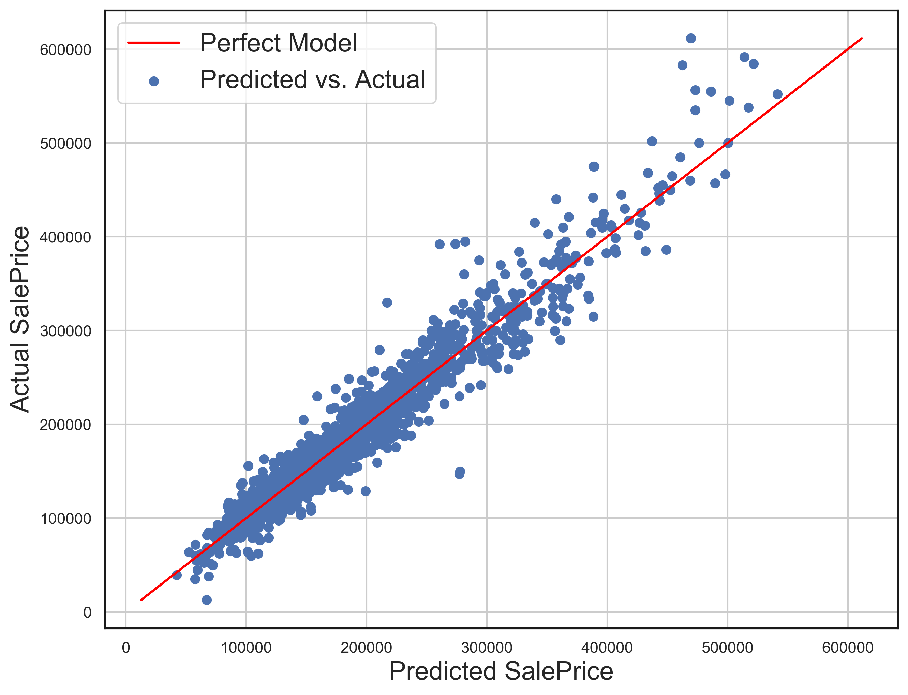

        
<figcaption>Figure 15a. Predicted SalePrice vs. Actual SalePrice (Ridge Regression).</figcaption>
  
    </figure> 
</td>    
<td bgcolor="ghostwhite">
    <figure>
        
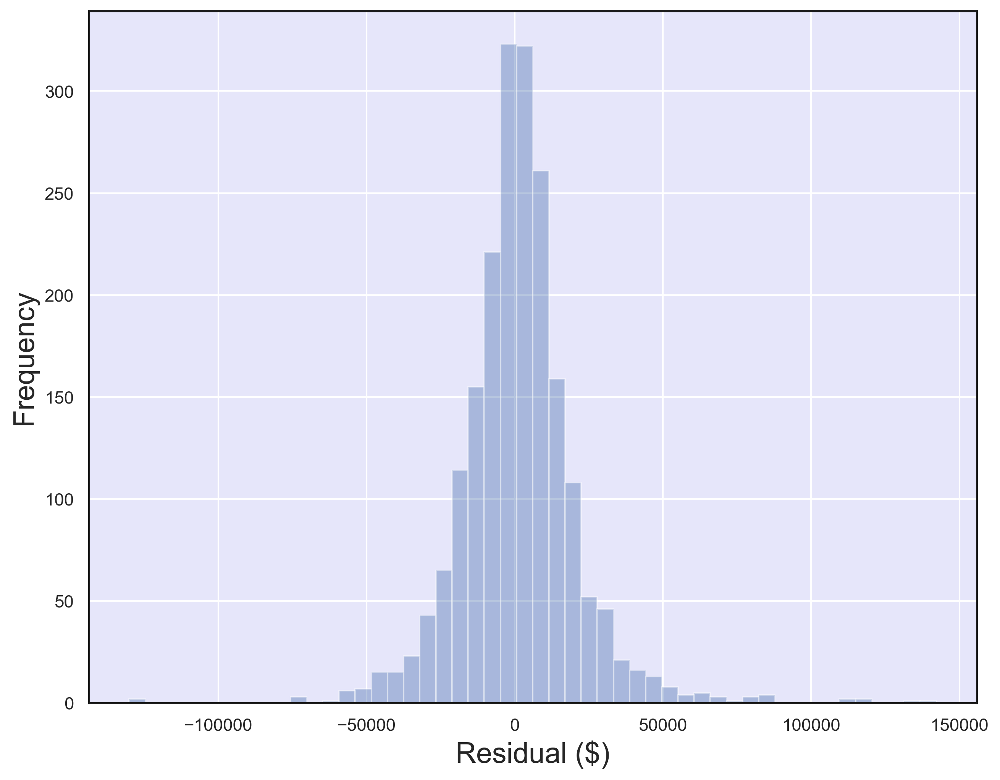

        
<figcaption>Figure 15b. Residual of Ridge Reression.</figcaption>
  
    </figure> 
</td>
</tr></table> 

Below shows how linear, lasso, and ridge regression models perform on the Training data. All these models report RMSE around $21600. A total of 63 features are selected for the modeling. The cross validation and test score on Training set show that the model is not suffering from any bias, since the reported numbers for train and test sets are very similar. The rigorous features selection in previous steps leads to having very close R2 and RMSE scores among Lasso, Ridge and linear regression. These scores show that the data doesn't necessarily need regularization, since the purpose of regularization is (1) to dampen the coefficients with minimal substantial impacts on the target variable, and (2) to remove multicollinearity between independent variables. Figures 16 and 17 show the distribution of residuals and calculated coefficients for Ridge regularization. The residuals have a clean distribution along the zero line, but there are some deviations at very low or very high sales prices. This can be explained by the lack of enough observations at these two ends. Gr_Liv_Area columns has the most contribution to sale price prediction. The RMSE score for the independent Test set is $21096, which is slightly lower than the RMSE of $21600 for the Training set. This suggests that the model is not suffering from any high variance.

<table><tr>
<td bgcolor="ghostwhite"> 
    <figure>
        
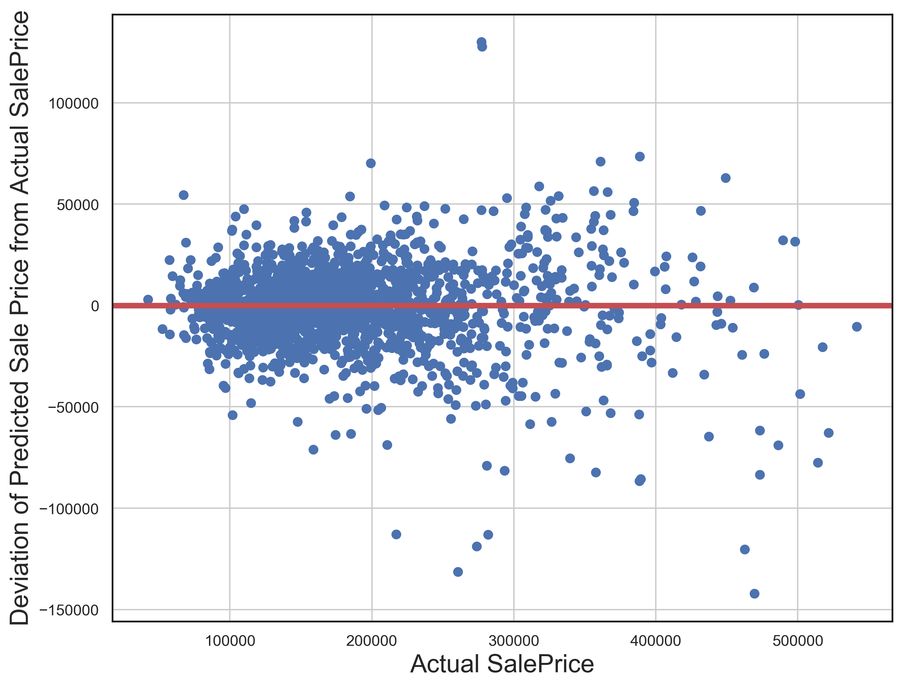

        
<figcaption>Figure 16. Scatter Distribution of Predicted Residuals (Ridge Regression).</figcaption>
  
    </figure> 
</td>    
<td bgcolor="ghostwhite">
    <figure>
        
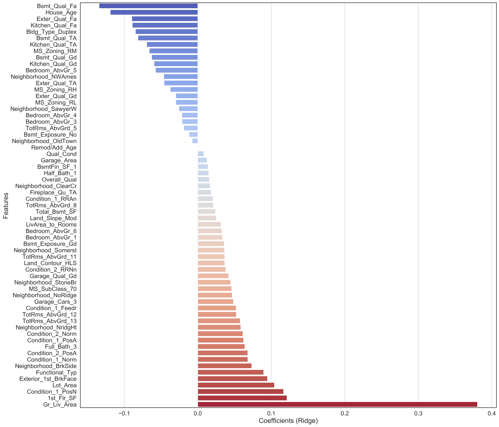

        
<figcaption>Figure 17. Coefficients Contribution to Sale Price Prediction.</figcaption>
  
    </figure> 
</td>
</tr></table> 

|Model|R2 Score (Train set from Training)|Cross Validation R2 Score (Train set from Training)|R2 Score (Test set from Training)|RMSE (Test set from Training)|
|:--- |:---|:---|:--- |:---|
|Lasso Regression|0.9219|0.9129|0.9223|21633.4983|
|Ridge Regression|0.9217|0.9138|0.9227|21601.8198|
|Linear Regression|0.922|0.9135|0.922|21582.3383|

### Conclusion

The EDA and the developed model suggest that sales price is a strong function of living area, house interior and exterior qualities, house age, neighborhood, and building types. The regularization techniques in Lasso and Ridge help to filter out the insignificant features. Below suggests that the score for linear regression without any regularization is close to the scores from Ridge or Lasso if and only if the significant features are selected for training the model.

###  References
[AmesHousing](http://jse.amstat.org/v19n3/decock/DataDocumentation.txt)  
[Facts About Ames](https://www.cityofames.org/about-ames/interesting-facts-about-ames)  
[Ames,_Iowa](https://en.wikipedia.org/wiki/Ames,_Iowa)  
[Ames, Best College Town](https://www.thinkames.com/ames-ia-named-best-college-town-in-america/)  
[Zillow](https://www.zillow.com/ia/home-values)  

